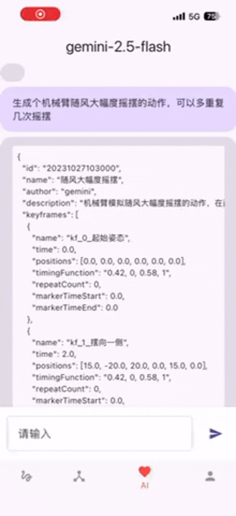
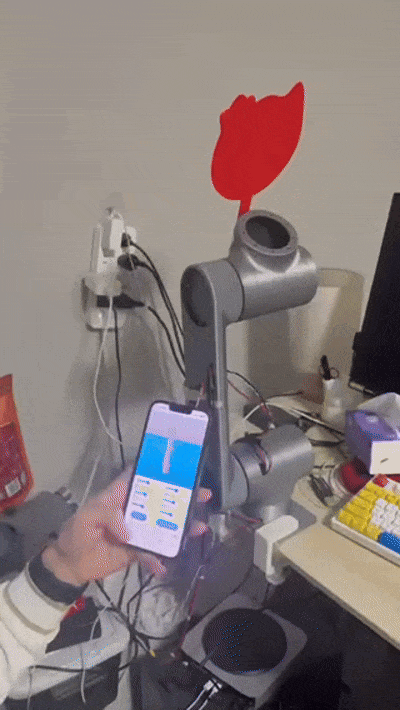

# 机械臂上位机APP

这是个个人项目，使用flutter技术栈做的app，用来控制机械臂。支持笛卡尔空间路径规划，关节空间角度规划，AI生成动作。

## 笛卡尔空间路径规划

## 关节空间角度规划

## AI生成动作

## APP控制机械臂

# 其他说明

硬件清单和单片机代码：(RoboticArm)[https://github.com/5sj-666/RoboticArm]
